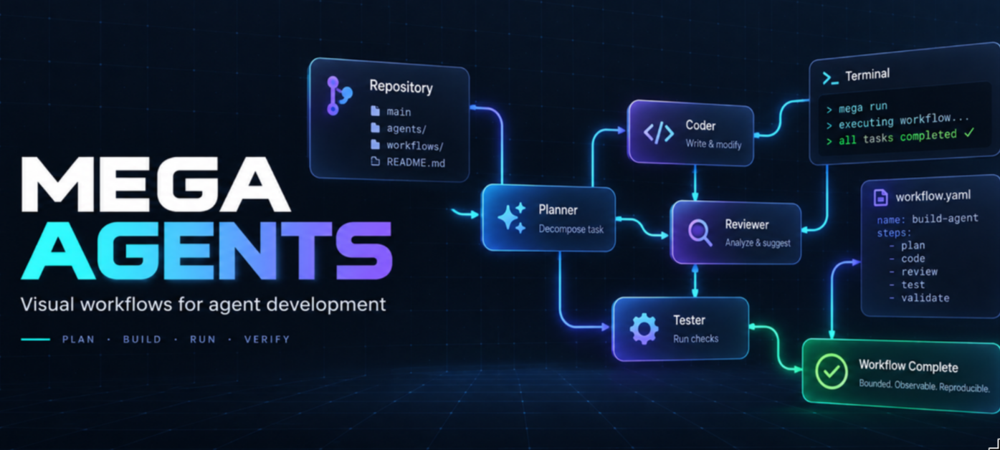

# Mega Agents



Mega Agents is an early-stage, local-first platform for designing and running
bounded agent-development workflows against existing repositories. Its goal is
to combine a Go orchestration engine, a visual block editor, and portable YAML
workflows so the same flow can run from the web interface, CLI, or CI—with live
progress, explicit scope, and repository-native quality gates.

The current repository is the foundation of that product: a Go server with an
embedded Svelte frontend, agent-development policy and evaluation tooling, and
the product proposal that guides the next implementation stages. See the
[product foundation](docs/product/agent-development-platform.md) for the full
vision and constraints.

## Setup

Install Go, Bun, Make, and Gitleaks, then:

```sh
make install  # after dependency or pinned-tool changes
make setup    # enables the tracked pre-commit hook
```

## Run

```sh
make build
./bin/mega-agents  # PORT=3000 to override the default 8080
```

Open <http://localhost:8080> (status endpoint: `/api/status`).

For frontend development with hot reload: `make dev-frontend`. Re-run
`make build` after frontend changes and restart the server.

## Command line

The same binary runs workflows headless and inspects recorded runs:

```sh
./bin/mega-agents run workflow.yaml     # a workflow exported from the editor
./bin/mega-agents run graph.json        # or the editor's JSON graph
./bin/mega-agents workflows             # workflows saved from the editor
./bin/mega-agents run <name>            # run a saved workflow by name
./bin/mega-agents runs                  # recorded runs, newest first
./bin/mega-agents runs show <run-id>    # each step's status, error and details
./bin/mega-agents logs <run-id> [step]  # every step's log, or one by id or name
```

The editor's **Save** writes the workflow as YAML to
`$MEGA_AGENTS_HOME/workflows/<name>.yaml`; **Open…** loads one back and
**Import YAML** loads any exported file. The graph in progress is also kept in
the browser, so reloading the page does not lose it.

Every run, whether started from the editor or the command line, keeps its
record and the log of each step under `$MEGA_AGENTS_HOME/runs` (default
`~/.mega-agents/runs`). In the editor, select a block after a run and choose
**Show logs**, or use **Logs** beside a step in the run result. **Cancel run**
stops the run in progress (its agent CLIs included), **Runs…** reopens any
recorded run on the canvas, and Ctrl-C stops a command-line run; either way
the run is recorded as cancelled.

## Blocks that run

- **GitHub** flagged as a starting point runs its **Actions** in order:
  *Fetch*, *Create worktree* (outputs a `workspace`), and *Rebase*. Without
  actions it fetches. Runs use the machine's existing Git credentials.
- **Agent** runs one conversation with a coding-agent CLI (Claude Code, Codex,
  Grok or OpenCode) in the workspace connected to it, or in its project's
  folder. Its prompt may use `{{workspace.path}}`, `{{workspace.branch}}`,
  `{{workspace.base}}`, `{{workspace.repository}}`, and the results of
  connected agents as `{{result}}` or `{{results.<agent>}}`. With an
  **Output schema** (JSON Schema, strict subset) the reply is validated and
  repaired on the same session up to **Retries** times. An agent flagged as a
  starting point starts a run on its own.

- **JSON Schema** (`output/json-schema@v1`) validates the one value connected
  to it (usually an agent's result) against any JSON Schema. A valid value
  leaves on its `valid` output; an invalid one leaves on `invalid` with the
  value and field-level errors when an arrow takes that branch, and otherwise
  fails the run. Choose each outgoing arrow's output in the block's
  properties.

- **Router** sends the one value connected to it down the first case whose
  CEL condition over `value` holds (for example `value.verdict == "approve"`),
  or down `default`, as `{"case": ..., "value": ...}`. Expressions are
  type-checked when the run is planned and evaluated under a cost limit;
  arrows on routes not taken are skipped.

| Backend | CLI | Schema | Verified live |
| --- | --- | --- | --- |
| `claude` | `claude --print --output-format stream-json` | `--json-schema` | ✅ haiku |
| `codex` | `codex exec --json` | `--output-schema` file | ✅ default model |
| `opencode` | `opencode run --format json` | in the prompt, validated | ✅ `opencode-go/glm-5.3-flash` |
| `grok` | `grok --output-format json` | `--json-schema` | ⬜ unit-tested only (no credits) |

Agents run with their CLI's non-interactive permission bypass inside the
workspace, like the fitflow driver's workers; point them at worktrees, not at
checkouts you care about.

## Checks

- `make verify` — types, Go and frontend tests with coverage, formatting,
  lint, static analysis, CI-doc sync, size budgets, and the embedded build.
- `make gates` — repository policy executables under `scripts/gates/`.
- `make smoke` — launches the app, probes the status endpoint, and runs the
  `runs` command against an empty home.
- `make e2e` — Playwright specs against the dev server and a real Go backend.
- `make gate-self-test` — proves the gates reject bad fixtures.

When `Makefile`, `.github/workflows/*.yml`, or `scripts/gates/*` changes,
update `docs/ci-doc.md`. A behavior-preserving refactor may instead include
the content-bound `.ci-doc-no-impact` declaration described there.

## Agent evaluation

One deterministic, diagnosis-only scenario runs the selected agent tool in a
disposable Git worktree:

```sh
make agent-eval TOOL=opencode MODEL=opencode-go/glm-5.3-flash
```

The full per-tool examples and pass criteria are documented in
[`docs/agent-development.md`](docs/agent-development.md#agent-evaluation).

## Documentation

- [`docs/product/agent-development-platform.md`](docs/product/agent-development-platform.md)
  — product foundation for the proposed successor agent-development platform.
- [`docs/agent-development.md`](docs/agent-development.md) — development-agent
  operating model, agent evaluation, controls, and planned gaps.
- [`docs/ci-doc.md`](docs/ci-doc.md) — guardrail status and CI facts.
- [`docs/ci-files.md`](docs/ci-files.md) — index of CI-defining files.
- [`docs/custom-gates.md`](docs/custom-gates.md) — gate conventions and
  extension steps.
